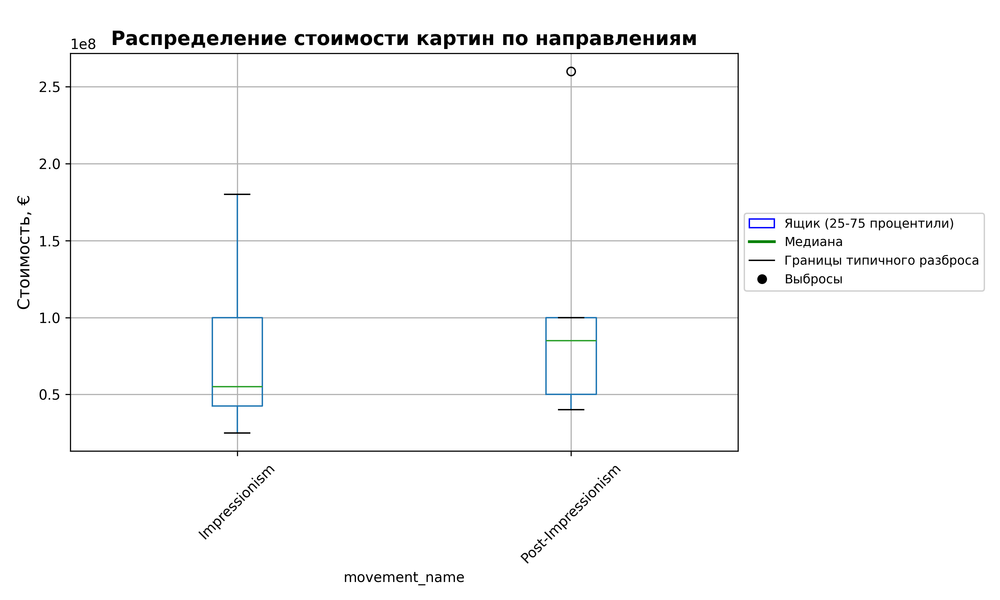

# Реализация A/B-теста на основе БД

## Гипотеза
Средняя стоимость картин **импрессионистов** выше, чем у **постимпрессионистов**.

## Используемый метод
Метод Манна-Уитни (непараметрический U-тест).

## Результаты

- **Средняя стоимость импрессионистов:** 74 545 454,55 €  
- **Средняя стоимость постимпрессионистов:** 107 000 000,00 €  
- **U-statistic:** 21.5000  
- **p-value:** 0.769578

## Вывод

Статистически значимой разницы нет (p-value > 0.05).

Тест Манна-Уитни показал U = 21.5 при ожидаемом значении 27.5 (при отсутствии разницы). Значение U ниже ожидаемого указывает на то, что картины импрессионистов в выборке имеют более низкие ранги стоимости, то есть в среднем дешевле. Однако p-value = 0.77 значительно превышает порог значимости 0.05, что означает отсутствие статистически значимой разницы между группами. Наблюдаемая разница в средних (74.5 млн € против 107 млн €) может быть полностью объяснена случайными колебаниями в малой выборке.

## Визуализация

