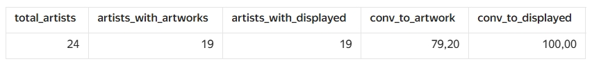
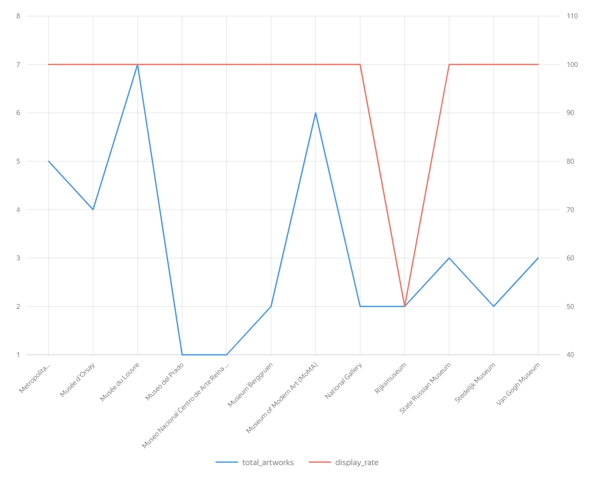
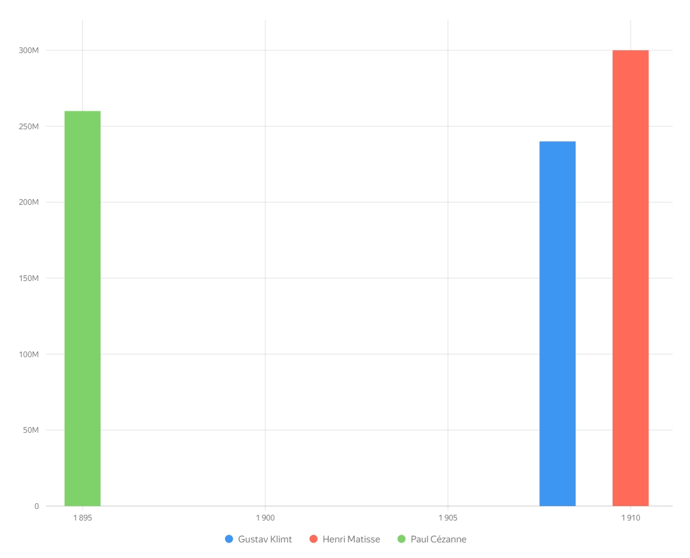
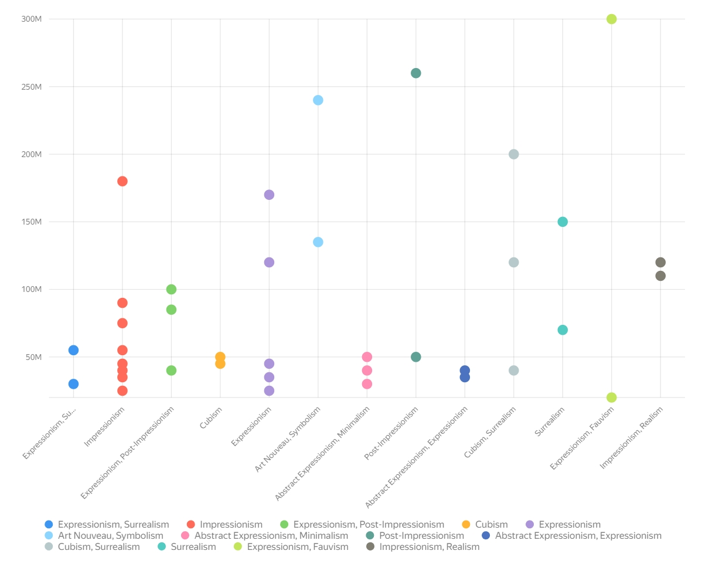

# Дашборд: Анализ европейского художественного наследия

Дашборд демонстрирует ключевые навыки **продуктового аналитика**: воронки, сегментация пользователей, эффективность каналов, выявление аномалий, работа со статистикой.

Данные: 24 художника, 39 картин, 16 музеев, 16 художественных направлений (XIX–XX века).

---
## 1. Воронка конверсии «художник → создание картины → выставление»

**Аналогия в продукте:**  
Воронка регистрации → создания контента → публикации (модерации).

**Что показывает:**  
Какой процент художников доходит до каждого этапа.  
Конверсия из создания в выставление

## 3. Эффективность музеев (процент выставленных картин)

**Аналогия в продукте:**  
Конверсия каналов привлечения или торговых площадок (доля товаров, которые активны/проданы).

## 4. Рейтинг самых дорогих картин (выбросы)

**Аналогия в продукте:**  
Выявление аномально крупных заказов, fraud-активности или нестандартных транзакций.

## 5. Точечная диаграмма: разброс цен по всем картинам

**Аналогия в продукте:**  
Разброс чеков по пользователям или заказов по категориям: видно, где основная масса значений, а где редкие дорогие выбросы.

Работа показывает, как на основе небольшого набора данных можно собрать аналитический дашборд, выявить выбросы и сравнить группы по стоимости и эффективности.

## Файлы

- [CSV files](dashboard_data)
- [Images](images)

## Инструменты

- Yandex DataLens - визуализация
- PostgreSQL - хранение данных
- SQL - подготовка датасетов
